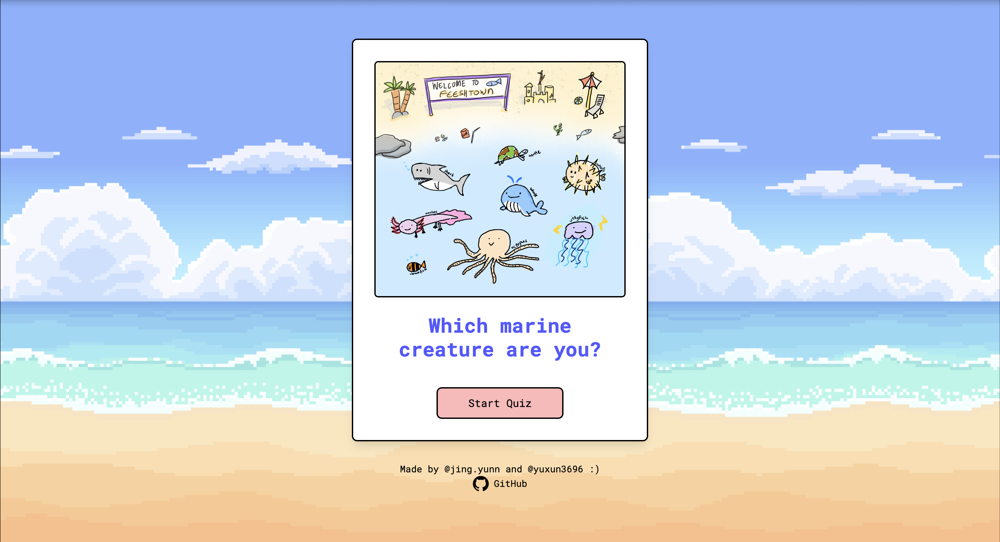
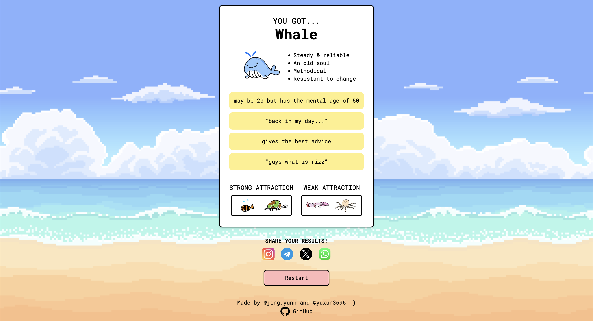

## About the project 
Feesh is a passion project with the intention of turning our imaginative storyline and cute characters into a personality quiz. Feesh focuses on attracting users with its adorable characters and creative designs.  

## Setting up the project locally
1. ``git clone https://github.com/yuxunn/feesh`` on terminal 
2. ``npm install`` on the root directory 
3. ``npm run dev`` to start hosting the project locally. 
4. Open [http://localhost:3000](http://localhost:3000) with your browser to view the webpage.

## Screenshots of Feesh

## Deployment 
Feesh has been deployed as of 21st October 2024. The website can be accessed [here](feesh-rose.vercel.app)! 

## Authors
🐳 **Jing Yun** [@taugwa](https://github.com/taugwa)

🐳 **Yu Xun** [@yuxunn](https://github.com/yuxunn)